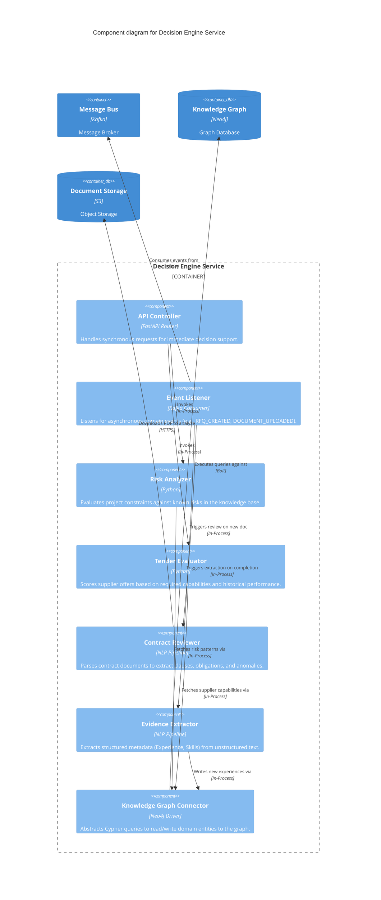

# Component Diagram (Level 3) - Decision Engine

This document zooms into the **Decision Engine Service** container to show its internal structure. This service is responsible for the core intelligent capabilities of the MetalHub platform, such as capturing evidence, detecting risk, and evaluating tenders.

## C4 Component Diagram

## Description

The **Decision Engine** is highly modularized:
- **Controllers/Listeners**: It handles both real-time synchronous requests (e.g., a user requesting a manual risk check) via the `API Controller`, and asynchronous background tasks (e.g., scanning a newly uploaded PDF) via the `Event Listener`.
- **Core Domain Logic**: 
  - `Risk Analyzer` and `Tender Evaluator` leverage the graph to make recommendations.
  - `Contract Reviewer` and `Evidence Extractor` apply NLP to turn unstructured data (documents) into structured knowledge (nodes and edges).
- **Integration**: The `Knowledge Graph Connector` encapsulates all database complexity, allowing the domain components to work with pure Python objects.
