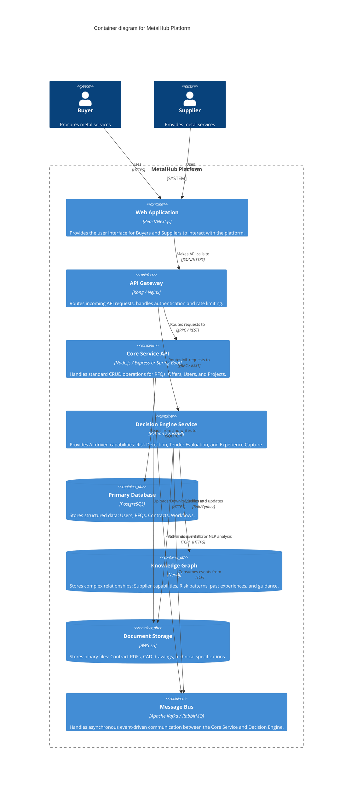

# Container Diagram (Level 2)

This document breaks down the MetalHub platform into its high-level containers, showing how the UI, APIs, specialized services, and databases interact.

## C4 Container Diagram

## Description

- **Web Application**: The frontend portal for user interaction.
- **Core Service API**: The operational backbone for standard transactional data.
- **Decision Engine Service**: A specialized analytical engine. When an RFQ is created or a Contract is uploaded, the Core Service publishes an event. The Decision Engine picks this up, analyzes the text/data, evaluates risks against the Knowledge Graph, and updates the Primary Database with its findings.
- **Knowledge Graph**: Crucial for connecting isolated pieces of information, such as linking a specific material risk to a historical failed project, providing intelligent guidance to Buyers.
