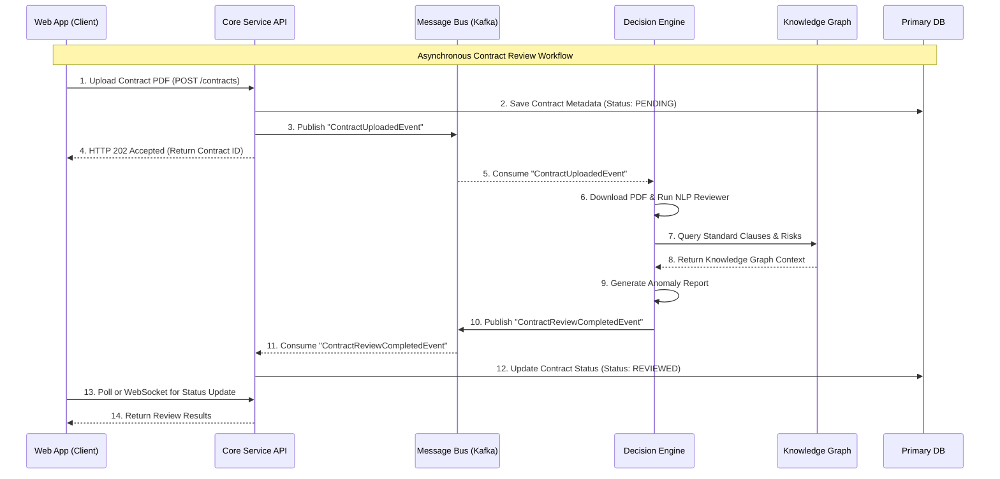

# Integration Architecture

This document describes how the primary bounded contexts within MetalHub integrate with one another, balancing immediate consistency with asynchronous decoupling.

## Integration Mechanisms

MetalHub utilizes a hybrid integration approach:
1. **Synchronous (REST/gRPC)**: Used when a user requires immediate feedback (e.g., retrieving a list of RFQs, logging in, manual risk check).
2. **Asynchronous (Event-Driven)**: Used for long-running processes (e.g., PDF text extraction) or to decouple domain side-effects (e.g., updating supplier experience score when a project finishes).

## Event-Driven Flow Diagram

## Description

The sequence diagram above illustrates the asynchronous decoupling between the Core Service and the Decision Engine using a Message Bus:
- **Decoupling**: The Core Service doesn't need to know how the Decision Engine works or wait for it to finish. It simply announces that a contract was uploaded.
- **Resilience**: If the Decision Engine is down, the Message Bus retains the event. Once the Decision Engine recovers, it resumes processing without data loss.
- **Scalability**: Heavy NLP tasks don't block the Core API's HTTP threads, ensuring the platform remains highly responsive to user requests.
