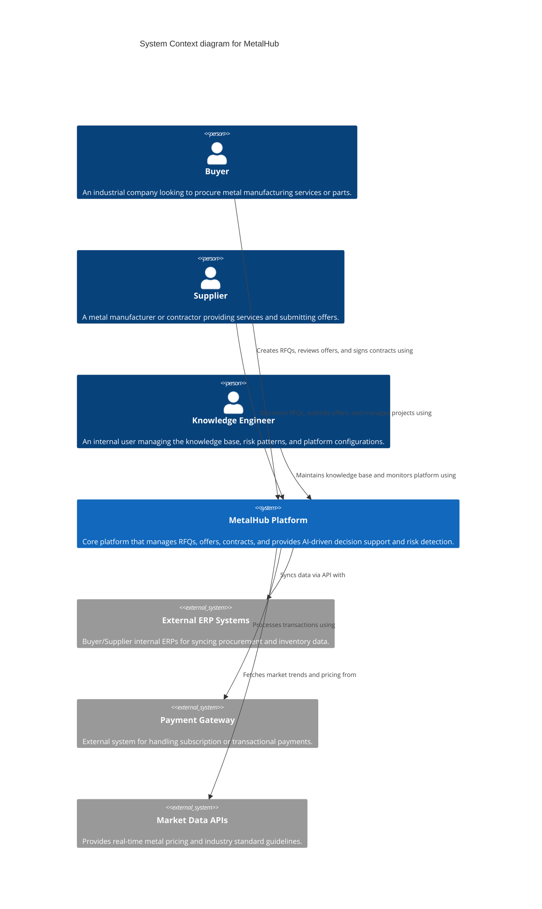

# System Context Diagram (Level 1)

This document describes the high-level System Context for the MetalHub platform. MetalHub is an intelligent industrial metal contracting platform that connects Buyers and Suppliers, facilitating RFQ creation, tender evaluation, and contract review while leveraging a knowledge-driven decision support system.

## C4 System Context Diagram

## Description

The **MetalHub Platform** acts as the central intelligence hub.
- **Actors**: 
  - **Buyers** use the platform to mitigate risk when issuing RFQs and evaluating tenders.
  - **Suppliers** use it to discover relevant RFQs matching their capabilities and to construct competitive offers.
  - **Knowledge Engineers** oversee the knowledge graph and rules engine, ensuring the decision support system remains accurate.
- **External Systems**: The platform integrates with external ERPs to seamlessly fit into existing supply chain workflows, queries Market Data APIs for live material costs, and relies on a Payment Gateway for monetization.
